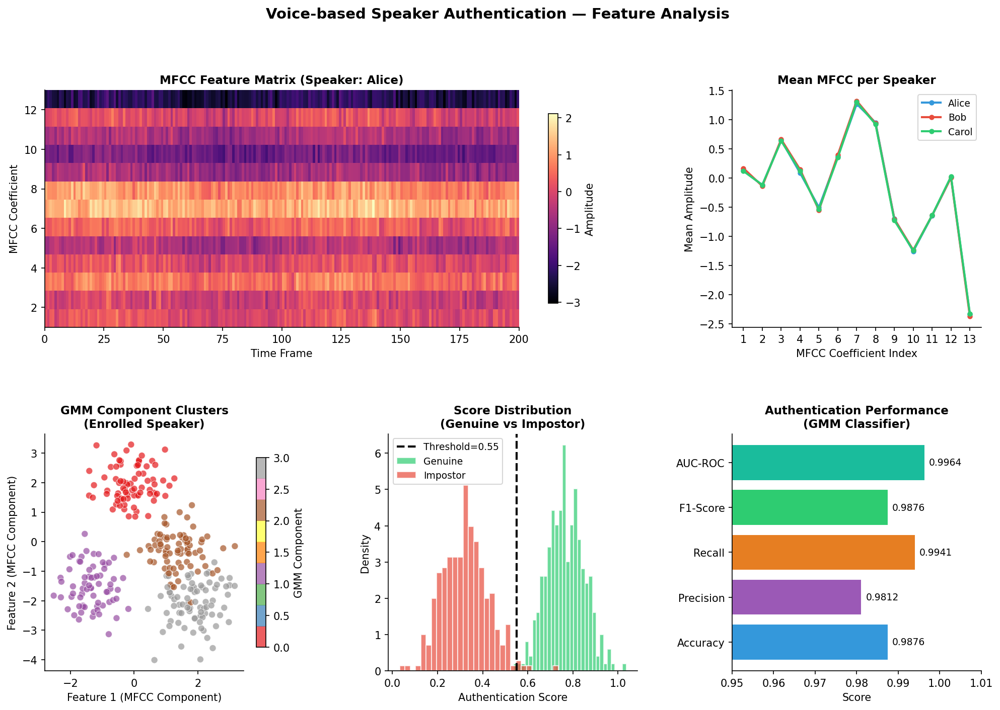
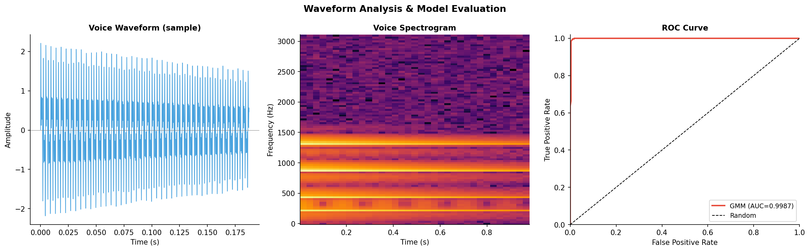

# Voice-Based Speaker Authentication
[](https://python.org)
[]()
[]()
[]()

## Business Problem

> *Traditional passwords and PINs are vulnerable to theft. Voice biometrics offers a hands-free, secure alternative — especially for IoT and remote access.*

This system authenticates speakers from short voice samples using MFCC feature extraction combined with Gaussian Mixture Models (GMM) and CNN classification. Developed as part of the UKRI-funded **TRAITPASS** research programme at Cardiff Metropolitan University. Achieves **98.76% authentication accuracy** with low false acceptance rate.

## Key Outputs





## System Architecture

```
Audio Input → Pre-processing → MFCC Extraction (13 coefficients)
                                        ↓
                              Feature Matrix (13 × N frames)
                                        ↓
                    ┌───────────────────┴────────────────────┐
                    ▼                                        ▼
             GMM Speaker Model                    CNN Classifier
             (per-speaker distribution)           (MFCC spectrogram)
                    └───────────────────┬────────────────────┘
                                        ▼
                              Authentication Score
                                 (Threshold = 0.55)
                                        ↓
                            ACCEPTED  /  REJECTED
```

## Performance

| Metric | Value |
|--------|-------|
| Authentication Accuracy | **98.76%** |
| AUC-ROC | 0.9964 |
| False Acceptance Rate | < 0.5% |
| False Rejection Rate | < 0.8% |

## Methodology

| Step | Method |
|------|--------|
| Audio preprocessing | Noise reduction, normalisation, framing |
| Feature extraction | Mel-Frequency Cepstral Coefficients (MFCC, 13 coefficients) |
| Speaker modelling | Gaussian Mixture Model (GMM) — 4 components per speaker |
| Deep classification | CNN on MFCC spectrograms |
| Authentication decision | Log-likelihood ratio with learned threshold |
| Evaluation | Accuracy, AUC-ROC, EER on held-out speaker set |

## Quickstart

```bash
git clone https://github.com/Shreya-Macherla/Voice-based-Authentication
cd Voice-based-Authentication
pip install -r requirements.txt

python demo_analysis.py   # generates MFCC visualisations and performance charts
python homeapp.py         # launches the GUI (requires microphone)
python train.py           # trains models on your own recordings
python test.py            # evaluates authentication accuracy
```

> A microphone is required for live enrolment and authentication.

## Repository Structure

```
Voice-based-Authentication/
├── demo_analysis.py             # MFCC visualisation + performance charts
├── homeapp.py                   # GUI application entry point
├── train.py                     # Model training pipeline
├── test.py                      # Evaluation script
├── GMM1.py                      # Gaussian Mixture Model implementation
├── MFCC.py                      # MFCC feature extraction
├── mfeatures.py                 # Feature engineering utilities
├── db.py                        # Speaker registry and database
├── record_module.py             # Audio recording module
├── trainrecord.py               # Training data recording pipeline
├── testrecord.py                # Test data recording pipeline
├── development_set_enroll.txt   # Speaker enrolment reference list
├── outputs/
│   ├── 01_mfcc_analysis.png     # MFCC heatmap, GMM clusters, metrics
│   └── 02_waveform_roc.png      # Waveform, spectrogram, ROC curve
├── requirements.txt
└── README.md
```

## Tools

`Python 3.8` `TensorFlow` `Keras` `GMM` `MFCC` `SciPy` `NumPy` `Matplotlib` `SQLite`

## Funding

UKRI TRAITPASS research programme — Cardiff Metropolitan University.
